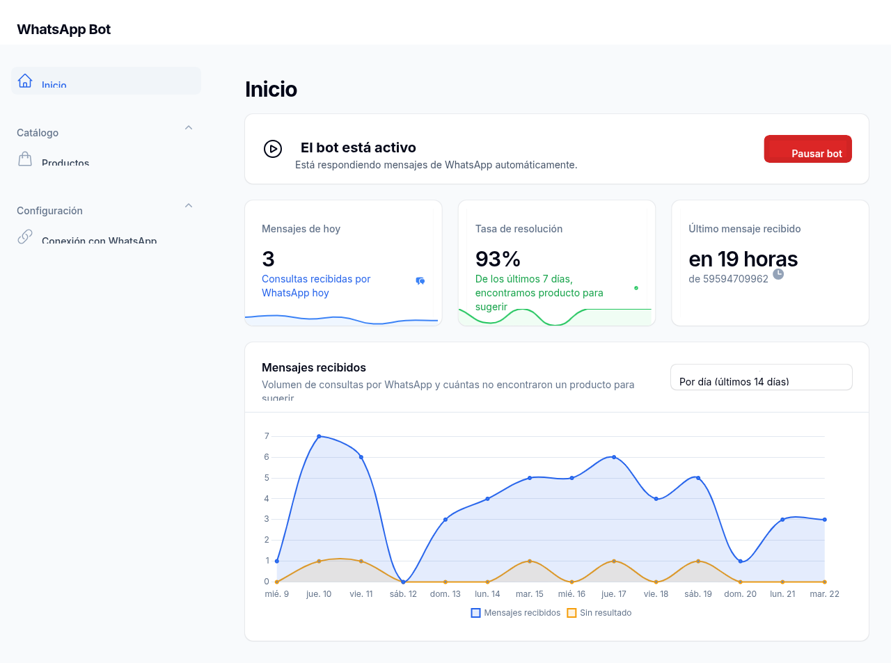
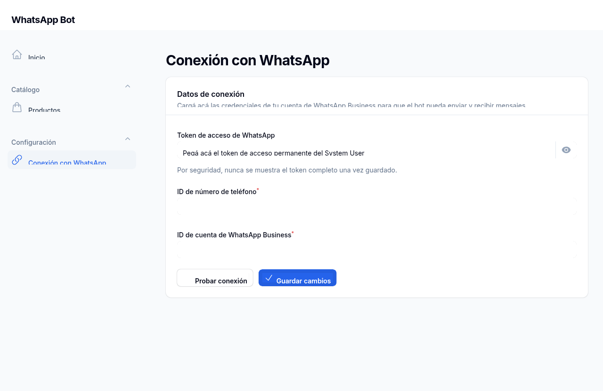
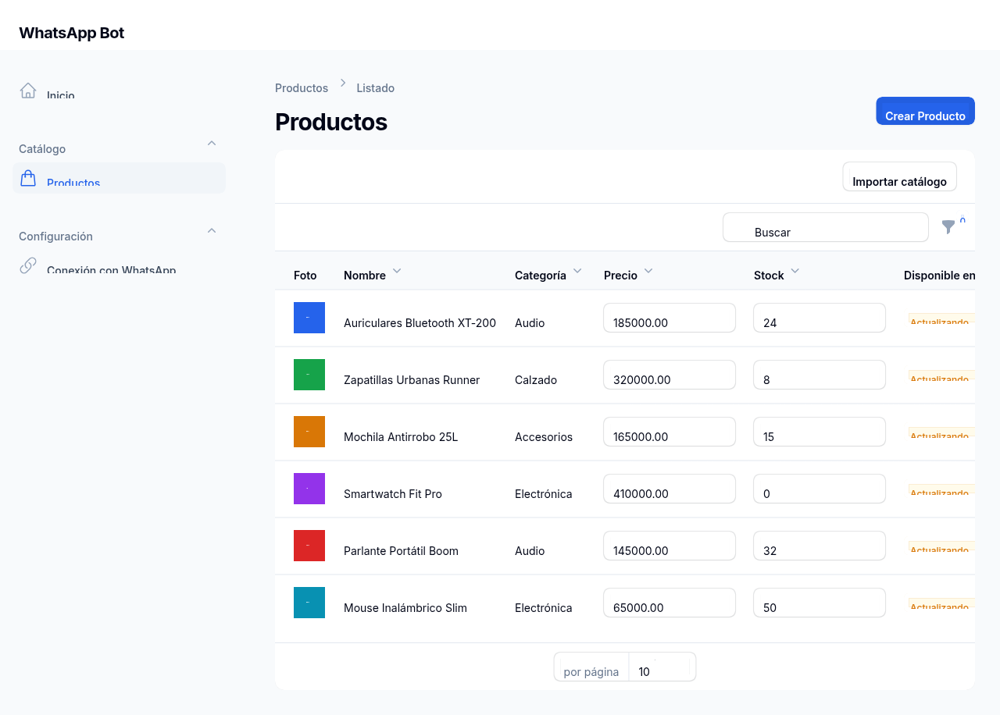
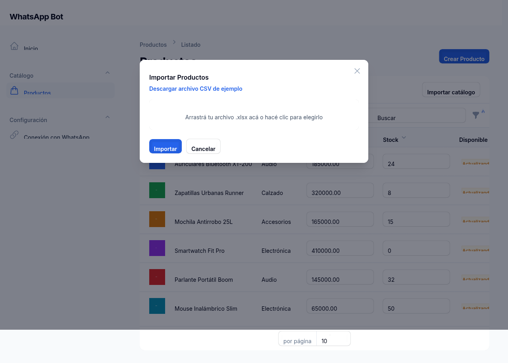
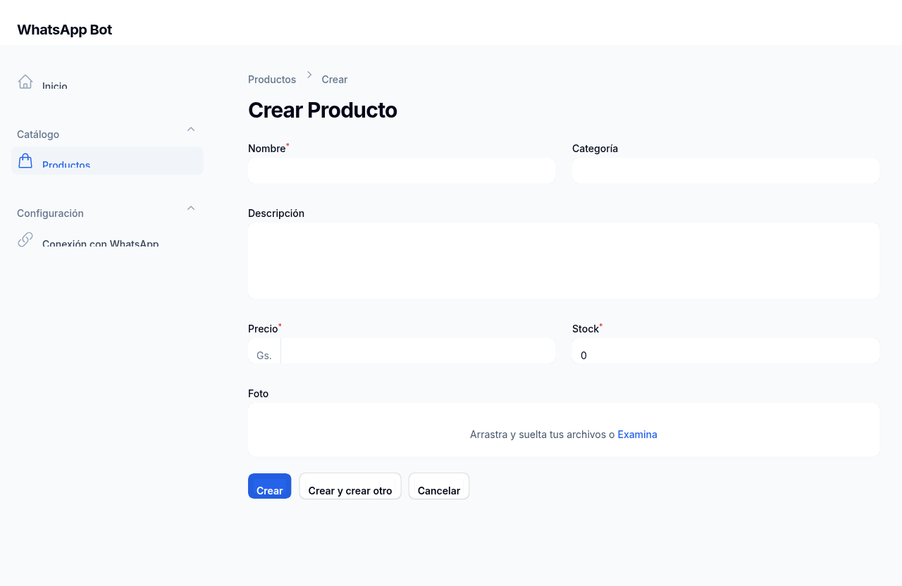
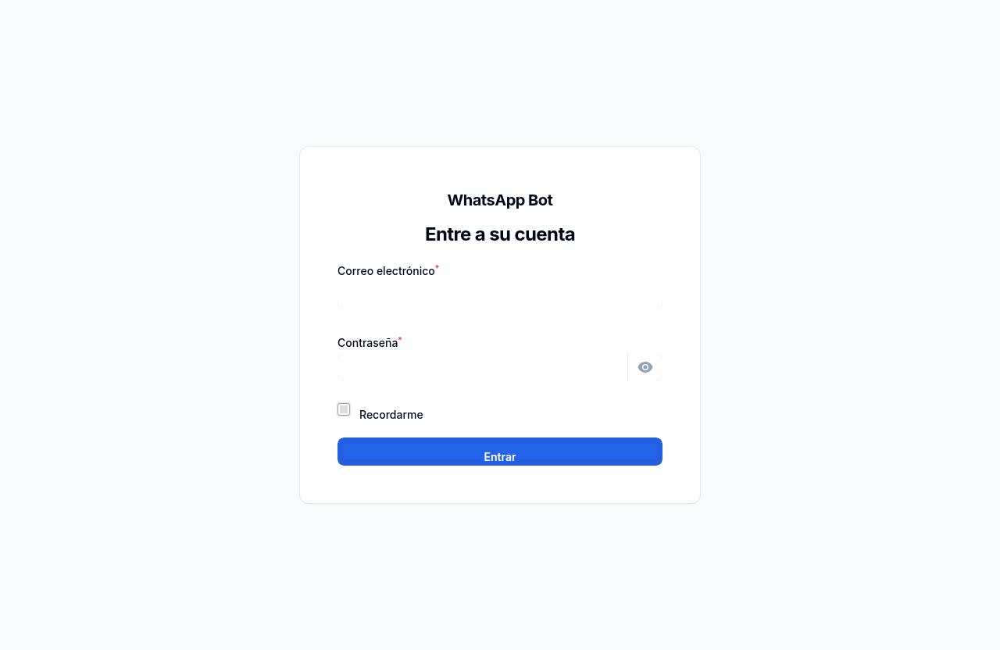

# WhatsApp Bot

Bot de WhatsApp con IA para catálogos grandes: responde consultas de clientes por texto o foto, busca productos por similitud semántica y se administra desde un panel Filament.

## Capturas

|  |  |
|---|---|
| **Inicio** — estado del bot y métricas del día | **Conexión con WhatsApp** — credenciales enmascaradas y prueba de conexión |
|  |  |
| **Productos** — listado con edición inline y filtro por categoría | **Importar catálogo** — mapeo de columnas desde un XLSX |
|  |  |
| **Crear producto** | **Acceso** |
|  |  |

## Stack

- **Laravel 13** + **Filament 3** (panel admin)
- **PostgreSQL** con **pgvector** (búsqueda semántica del catálogo)
- **Redis** + Laravel Queues (el webhook de WhatsApp responde al instante, el procesamiento pesado va a cola)
- **DeepSeek API** (texto y visión) para interpretar consultas y fotos de productos
- **WhatsApp Cloud API** (Meta) para mensajería

## Arquitectura

El código de negocio vive por dominio en `app/Domains/`, auto-registrado (cero configuración manual al agregar un dominio nuevo):

- **Catalog** — productos, búsqueda semántica, generación de embeddings, importación de catálogo.
- **WhatsApp** — webhook, cliente de la Cloud API, procesamiento de mensajes entrantes.
- **Settings** — estado del bot (on/off) y credenciales de conexión con Meta.

Ver [`rules/architecture.mdc`](rules/architecture.mdc) para el detalle de la convención de carpetas.

## Requisitos previos

- PHP 8.3+ con las extensiones `pdo_pgsql`, `pgsql`, `intl`, `mbstring`, `zip` y `curl` (las últimas cuatro las pide Filament, Pest y la importación de catálogo respectivamente — sin `zip` no se puede ni leer ni escribir el `.xlsx` del catálogo)
- Composer 2
- PostgreSQL 14+ con la extensión [pgvector](https://github.com/pgvector/pgvector) instalada a nivel de sistema
- Redis
- Una cuenta de [DeepSeek](https://platform.deepseek.com) con API key
- Una app de [Meta for Developers](https://developers.facebook.com) con el producto WhatsApp habilitado

## Instalación

### 1. Clonar e instalar dependencias

```bash
git clone <url-del-repo> chatbot
cd chatbot
composer install
```

### 2. Variables de entorno

```bash
cp .env.example .env
php artisan key:generate
```

Editá `DB_DATABASE`, `DB_USERNAME` y `DB_PASSWORD` en `.env` según tu instalación de PostgreSQL. Las demás variables (`DEEPSEEK_*`, `WHATSAPP_*`) se pueden completar ahora o más adelante — el token y los IDs de WhatsApp también se pueden cargar después desde el panel, en **Configuración → Conexión con WhatsApp**.

### 3. Base de datos

Instalá la extensión pgvector en tu servidor de PostgreSQL (varía según el sistema operativo, ver la [guía oficial](https://github.com/pgvector/pgvector#installation)). En Ubuntu/Debian, por ejemplo:

```bash
sudo apt install postgresql-16-pgvector
```

Creá la base de datos:

```bash
sudo -u postgres psql -c "CREATE DATABASE chatbot;"
```

### 4. Redis

```bash
sudo apt install redis-server
sudo systemctl enable --now redis-server
```

### 5. Migraciones y storage

```bash
php artisan vendor:publish --tag=filament-actions-migrations
php artisan migrate
php artisan storage:link
```

La migración `create_vector_extension` (del paquete `pgvector/pgvector`) crea la extensión `vector` en la base de datos automáticamente. El primer comando publica las tablas que usa el importador de catálogo (`imports`, `failed_import_rows`) — sin eso, "Importar catálogo" falla al primer uso.

### 6. Crear tu usuario del panel

```bash
php artisan make:filament-user
```

### 7. Levantar la app

En una terminal, el servidor web:

```bash
php artisan serve
```

En otra, el worker de colas (necesario para procesar mensajes de WhatsApp y generar embeddings):

```bash
php artisan queue:work redis
```

Entrá a `http://localhost:8000/admin` con el usuario que creaste en el paso 6.

### 8. Conectar WhatsApp y DeepSeek

- **DeepSeek**: cargá `DEEPSEEK_API_KEY` en `.env` (y reiniciá el servidor).
- **WhatsApp**: en el panel, entrá a **Configuración → Conexión con WhatsApp** y cargá el token de acceso, el ID de número de teléfono y el ID de cuenta de WhatsApp Business. Usá "Probar conexión" antes de guardar.
- **Webhook de Meta**: configurá en tu app de Meta el webhook apuntando a `https://tu-dominio/webhooks/whatsapp`, con el mismo valor que pusiste en `WHATSAPP_WEBHOOK_VERIFY_TOKEN` (`.env`). Para desarrollo local, exponé tu servidor con [ngrok](https://ngrok.com) o similar, ya que Meta no puede llegar a `localhost`. `WHATSAPP_APP_SECRET` (también en `.env`) se usa para validar la firma de cada mensaje entrante.

## Tests

La suite usa [Pest](https://pestphp.com). Como `products.embedding` es una columna `vector` (pgvector), los tests corren contra una base **Postgres real de test**, no contra sqlite — sqlite no tiene ese tipo de dato.

### Configuración (una vez)

```bash
sudo -u postgres psql -c "CREATE DATABASE chatbot_test;"
```

Revisá `phpunit.xml` / `.env.testing`: por defecto apuntan a `chatbot_test` en `127.0.0.1:5432` con usuario `postgres` y sin contraseña — ajustalo si tu Postgres local usa otras credenciales.

### Correr la suite

```bash
php artisan test                    # Unit + Feature
php artisan test --testsuite=Unit
php artisan test --testsuite=Feature
php artisan test --filter=NombreDelTest
```

### Tests E2E (navegador real, con Dusk)

```bash
php artisan dusk:chrome-driver      # una sola vez, descarga el ChromeDriver
php artisan serve                   # en otra terminal
php artisan dusk
```

Los tests de `tests/Browser/` necesitan la app corriendo de verdad (`php artisan serve`) contra Postgres, y en el caso de `ConnectionSettingsFlowTest`, acceso de red real a la Graph API de Meta (prueba con un token inválido, no hace falta uno real).

### Qué cubre

- `tests/Unit/` — construcción de la query de búsqueda semántica, mapeo de columnas del importador XLSX y filas inválidas, encriptado del token de Meta, lógica de bot activo/pausado.
- `tests/Feature/` — webhook (verificación, firma, despacho del job), procesamiento de mensajes entrantes (texto e imagen, con DeepSeek y WhatsApp mockeados vía `Http::fake()`), importación de catálogo, CRUD de productos en Filament, guardado de la conexión con Meta, toggle del bot.
- `tests/Browser/` — los mismos flujos de arriba pero clickeados en un Chrome real: pausar el bot y confirmar que un mensaje no genera respuesta, importar un XLSX desde la UI, cargar un token inválido y ver el error.
- `tests/Fixtures/` — payloads de WhatsApp (texto e imagen) y un catálogo XLSX de ejemplo (con columnas de nombres distintos a los del sistema, y dos filas inválidas a propósito).

### Extensiones necesarias

`DeepSeekClient` y `WhatsAppClient` usan el cliente `Http` de Laravel, así que `Http::fake()` los mockea a los dos sin tocar la red real. `ProductImporter` usa `Redis::incr/get/del` directamente (no `Cache::`) para que el contador de creados/actualizados sea atómico entre chunks paralelos del import — los tests que lo tocan mockean el facade `Redis` en vez de requerir un Redis real.

## Comandos útiles

```bash
php artisan migrate:fresh          # reiniciar la base de datos
php artisan queue:work redis       # procesar mensajes/embeddings en cola
vendor/bin/pint                    # formatear el código
```
